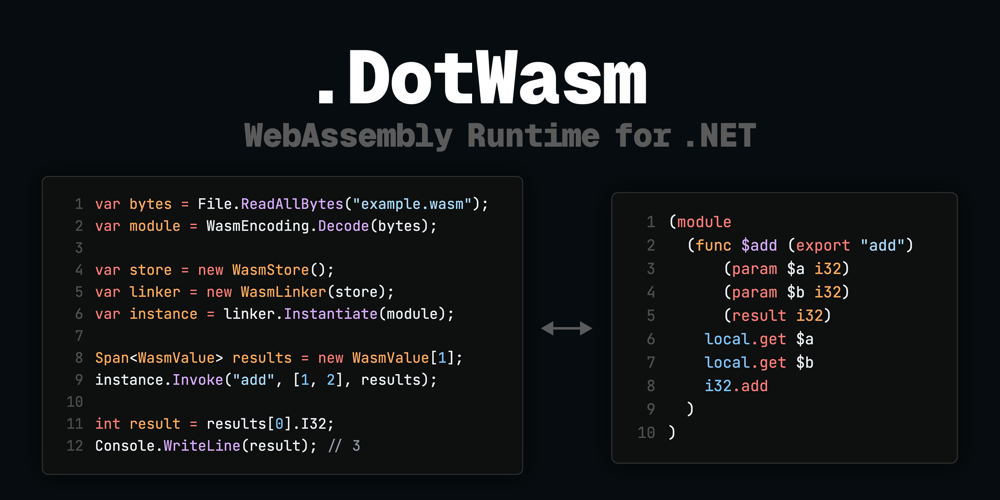

# DotWasm
A WebAssembly runtime implemented in C# for .NET



[](https://www.nuget.org/packages/DotWasm)
[](https://github.com/nuskey8/DotWasm/releases)
[](LICENSE)

[English](README.md) | 日本語

> [!CAUTION]
> DotWasmは現在アルファ版です。本番環境での利用には適しておらず、予告なく破壊的変更が行われる可能性があります。

## 概要

DotWasmはC#で実装された実験的なWebAssemblyランタイムです。100%純粋なC#で実装され、Wasm GCを含むWebAssembly 3.0のほぼ全てのProposalを実装しています。

## 特徴

- 純粋なC#で実装されたWebAssemblyランタイム
- WebAssembly 3.0相当のProposal(Threadsを除く)を全て実装
- 公式テストスイートを(ほぼ)100%通過
- 動的コード生成なし、NativeAOT互換

## インストール

DotWasmを利用するには.NET 10.0以上が必要です。

### .NET CLI

```bash
dotnet add DotWasm
```

## パッケージ構成

| Package            | NuGet                                                                                                            | 説明                                               |
| ------------------ | ---------------------------------------------------------------------------------------------------------------- | -------------------------------------------------- |
| DotWasm            | [](https://www.nuget.org/packages/DotWasm)                       | 全てのパッケージを含んだバンドル                   |
| DotWasm.Models     | [](https://www.nuget.org/packages/DotWasm.Models)         | wasmバイナリのC#モデルを提供するパッケージ         |
| DotWasm.Encoding   | [](https://www.nuget.org/packages/DotWasm.Encoding)     | wasmバイナリをデコードする機能を提供するパッケージ |
| DotWasm.Validation | [](https://www.nuget.org/packages/DotWasm.Validation) | wasmバイナリを検証する機能を提供するパッケージ     |
| DotWasm.Runtime    | [](https://www.nuget.org/packages/DotWasm.Runtime)       | wasmバイナリを実行する機能を提供するパッケージ     |

## クイックスタート

```wasm
;; example.wat
(module
  (func $add (param $x i32) (param $y i32) (result i32)
    local.get $x
    local.get $y
    i32.add
  )
  (export "add" (func $add))
)
```

```cs
using DotWasm.Encoding;
using DotWasm.Runtime;

var bytes = File.ReadAllBytes("example.wasm");
var module = WasmEncoding.Decode(bytes);

var store = new WasmStore();
var linker = new WasmLinker(store);
var instance = linker.Instantiate(module);

Span<WasmValue> results = new WasmValue[1];
instance.Invoke("add", [1, 2], results);

int result = results[0].I32;
Console.WriteLine(result); // 3
```

## Exportを取得する

`instance.TryGetExported**()`系のメソッドを用いてwasm側でexportされたglobalやmemoryなどを取得できます。

```wasm
;; example.wat
(module
  (global $g (export "my_global") (mut i32) (i32.const 42))
)
```

```cs
var instance = linker.Instantiate(module);

if (instance.TryGetExportedGlobal("my_global", out var global))
{
    Console.WriteLine(global.Value.I32);
    global.Value = 100;
}
```

## ホスト環境との統合

`WasmLinker`のAPIを通してwasm側にホストの関数やメモリなどを提供することが可能です。

```cs
var addFunc = new HostFunction
{
    Type = new FuncType
    {
        Parameters = [WasmTypes.I32, WasmTypes.I32],
        Results = [WasmTypes.I32],
    },
    Delegate = static (ReadOnlySpan<WasmValue> args, Span<WasmValue> results) =>
    {
        var a = args[0].I32;
        var b = args[1].I32;
        results[0] = WasmValue.FromI32(a + b);
    },
};
linker.RegisterFunction("env", "hostAdd", addFunc);

var memory = new MemoryInstance(1);
source.CopyTo(memory.Data);
linker.RegisterMemory("env", "hostMemory", memory);

var global = new GlobalInstance
{
    Mutable = true,
    ValueType = WasmTypes.I32,
    Value = 43,
};
linker.RegisterMemory("env", "hostGlobal", global);
```

## ExternalReference

ホスト環境の不透明な参照を`ExternalReference`としてwasm側に渡すことが可能です.

```cs
var gameObject = new GameObject("obj");

var global = new GlobalInstance
{
    Mutable = true,
    ValueType = WasmTypes.ExternRef(isNullable: false),
    Value = ExternalReference.Create(gameObject),
};

linker.RegisterMemory("env", "object", global);
```

## Proposals

DotWasmは現在以下のProposalに対応しています。

| Proposal                              | Status | Note |
| ------------------------------------- | ------ | ---- |
| WebAssembly 1.0 Core Spec             | ✅      |      |
| Mutable Globals                       | ✅      |      |
| Sign-extension operators              | ✅      |      |
| Non-trapping Float-to-int Conversions | ✅      |      |
| Multi-value                           | ✅      |      |
| Bulk Memory Operations                | ✅      |      |
| Reference Types                       | ✅      |      |
| SIMD                                  | ✅      |      |
| Component Model                       | ❌      |      |
| Relaxed SIMD                          | ✅      |      |
| Multi Memory                          | ✅      |      |
| Tail Call                             | ✅      |      |
| Extended Constant Expressions         | ✅      |      |
| Memory64                              | ✅      |      |
| Exception Handling                    | ✅      |      |
| Typed Function References             | ✅      |      |
| GC                                    | ✅      |      |
| Threads                               | ❌      |      |

## パフォーマンス

DotWasmは動的なGCアロケーションをゼロまたは最小限に抑えるように設計されていますが、実行速度に対しては今のところあまり最適化されていません。AOTサポートのために動的コード生成を利用しないため、JITを利用するWasmtimeなどの高速なランタイムと比較するとパフォーマンスは遥かに劣ります。

以下は128x128サイズの画像をグレイスケールに変換するベンチマークの結果です。

| Method   |         Mean |      Error |     StdDev |
| -------- | -----------: | ---------: | ---------: |
| Wasmtime |     20.79 us |   0.520 us |   1.493 us |
| WaaS     |  4,713.03 us |  94.249 us | 141.067 us |
| DotWasm  | 11,470.14 us | 217.310 us | 213.428 us |
| WACS     | 14,586.17 us | 285.006 us | 279.914 us |

比較には以下のライブラリを利用しています。

- [wasmtime-dotnet](https://github.com/bytecodealliance/wasmtime-dotnet)
- [WaaS](https://github.com/ruccho/WaaS)
- [WACS](https://github.com/kelnishi/WACS)

結果の通りDotWasmはかなり低速です。これは解決すべき問題であり、正式リリースまでに改善される予定です。

## ライセンス

[MIT License](LICENSE)
